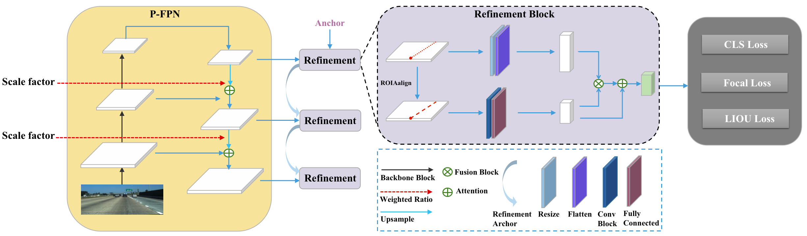

# Proportional Feature Pyramid Network of Cross Refinement for Lane Detection

Lane detection is to identify the lane line and position it accurately after the picture taken by the front camera of the vehicle is judged by the model.

# Datasets
If training script does not download the dataset, kindly download respective dataset from given links and place in the "
/data/" folder before starting the training.

## CULane
CULane dataset can be downloaded from [Openlink](https://xingangpan.github.io/projects/CULane.html)

## TuSimple
TuSimple dataset can be downloaded from [Openlink](https://github.com/TuSimple)
