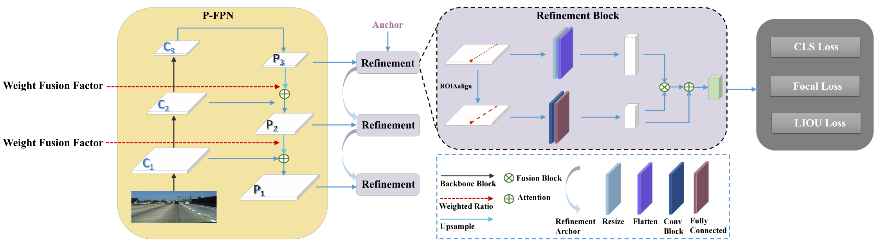
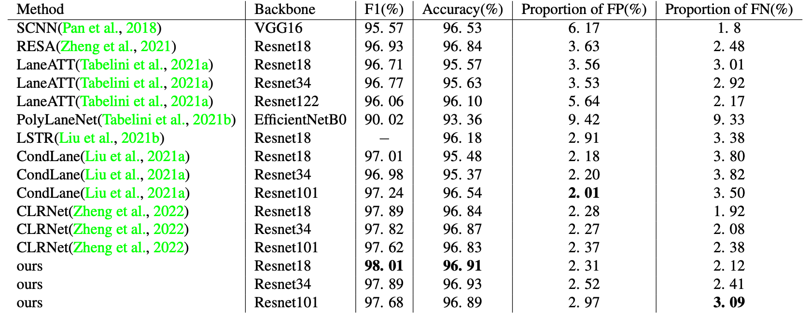
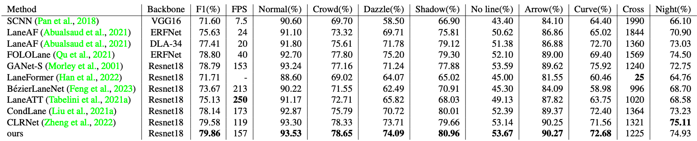
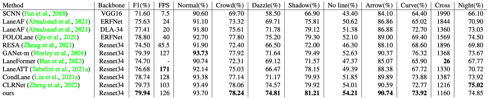
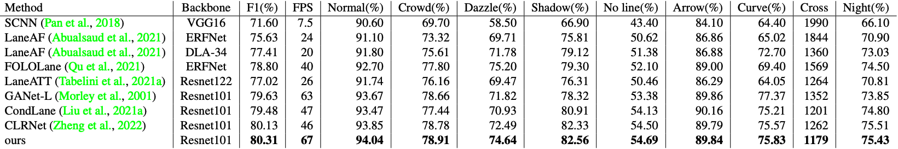

# Proportional Feature Pyramid Network of Cross Refinement for Lane Detection

Lane detection is to identify the lane line and position it accurately after the picture taken by the front camera of the vehicle is judged by the model.

# Datasets
If training script does not download the dataset, kindly download respective dataset from given links and place in the "
/data/" folder before starting the training.

## CULane
CULane dataset can be downloaded from [Openlink](https://xingangpan.github.io/projects/CULane.html)

## TuSimple
TuSimple dataset can be downloaded from [Openlink](https://github.com/TuSimple)

# Training
In the configuration file, different commands are used to call backbone and data sets. Our code is based on CLRNet modified with adjustable alpha super parameter of the algorithm in the tools folder, P - FPN in clrnet/models/necks/FPN. Py. The weight fusion factor can be calculated through the calculation in tools and then added to P-FPN.

```Shell
# For training, run
python main.py [configs/path_to_your_config] --gpus [gpu_num]
# For testing, run
python main.py [configs/path_to_your_config] --[test|validate] --load_from [path_to_your_model] --gpus [gpu_num]
```
# Proposed result
We conducted experiments on the TuSimple dataset and the CULane dataset

## The experimental results of Tusimple dataset are as follows：

## The experimental results of CULane dataset are as follows：
### Resnet18

### Resnet34

### Resnet101

